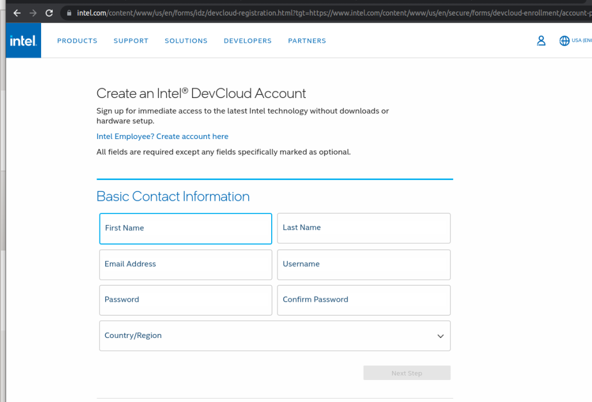
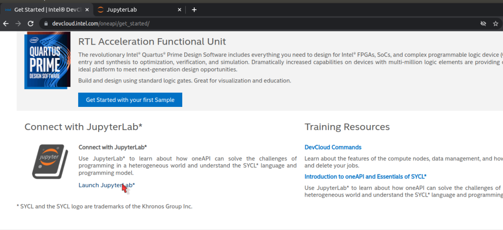
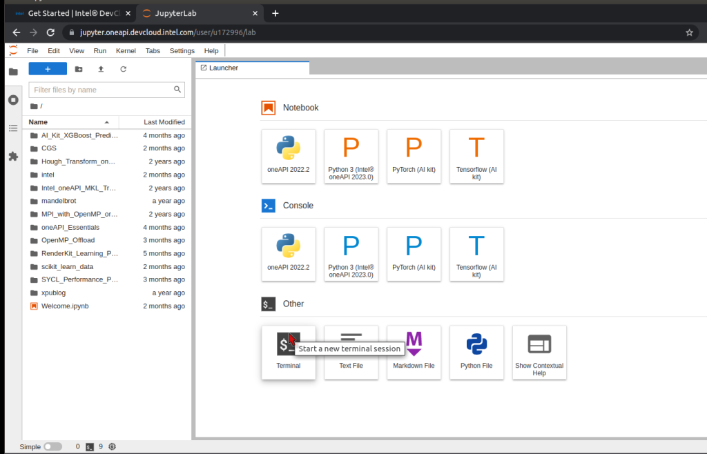
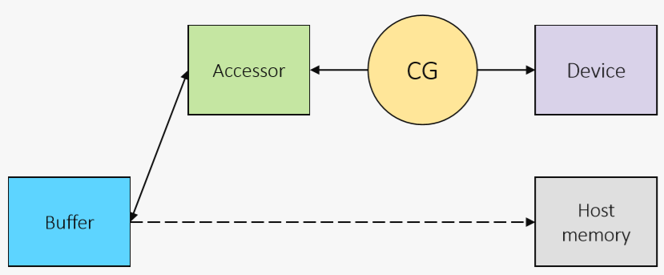
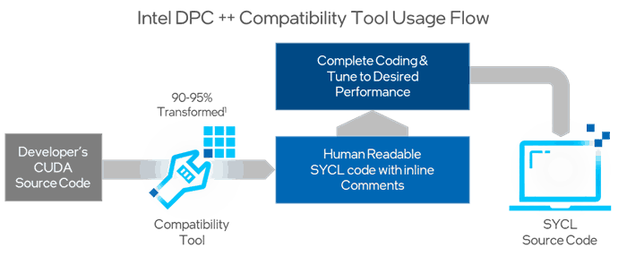
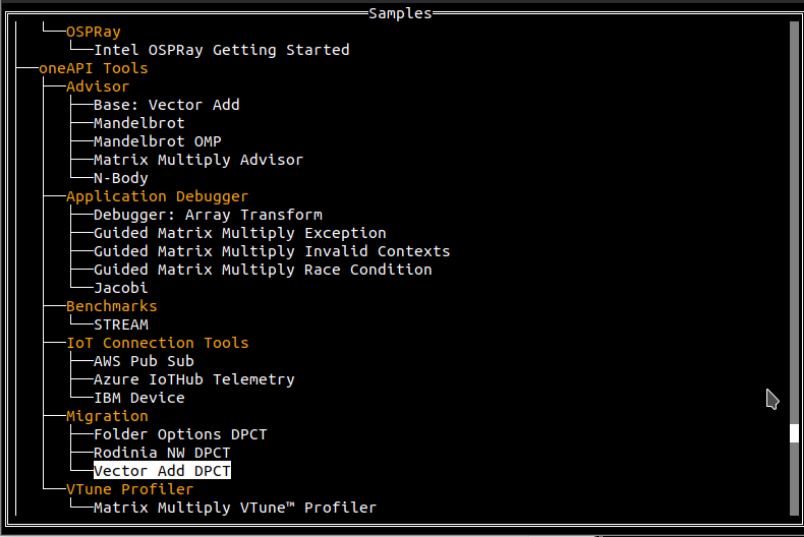

# oneAPI-Day: Encuentro desarrolladores Intel oneAPI Day (Madrid)

## Contenidos
* En este repositorio se encuentran los códigos propuestos en el taller [oneAPI-Day: Encuentro desarrolladores Intel oneAPI Day (Madrid)](https://www.danysoft.com/oneapi-day-madrid/)
* Para poner a punto el taller se recomienda seguir los pasos de la sección [Setup del lab](#setup-del-lab)
* Los códigos que vamos a trabajar están disponibles en la [sección "Ejemplos"](#ejemplos), resumidamente trabajan algunos de los aspectos mostrados en la parte teórica:
    * helloWorld: ilustra la selección de dispositivos
    * Memoria Buffer & Accessors: uso de buffers y accesors
    * Memoria USM: uso de USM
    * Suma de vectores: suma de vectores
    * Migración de código CUDA a SYCL (suma vectores)

* La descripción del [Hands-on](#to-do) se puede consultar a final de este fichero
    * Tratamiento de imágenes: reducción de ruido tipo sal & pimienta
    * Migración de código CUDA a SYCL (uso de *cublas*)


# Setup del lab

## Transparencias
* Todo el material está disponible en el repositorio [github](https://github.com/garsanca/oneAPI_Day_Abril23)
    * Puede descargarse fácilmente clonando el repositorio ejecutando en un terminal el comando ```git clone https://github.com/garsanca/oneAPI_Day_Abril23```
* Además las transparencias del taller están disponible en el [directorio "transparencias"](transparencias/seminario_oneAPI-Day_Madrid23.pdf) 


## Cuenta en DevCloud
* El [Intel® DevCloud for oneAPI](https://devcloud.intel.com/oneapi/) es un espacio de desarrollo **gratuito** para que la comunidad de desarrolladores puedan programar aplicaciones. Instrucciones para [solicitud de cuenta](transparencias/DevCloud_Setup_New_Users.pdf)
    * Múltiples **hw**: 
        * **CPUs**: desktop *i9-11900* y servidor tipo Xeon diferentes arquitecturas (Skylake,  Ice Lake, Sapphire Rapids)
        * **GPUs**: integradas UHD Intel® Core™ Gen9 y Gen11 
        * **FPGAs**: Arria 10 y Stratix 10
    * **sw**: oneAPI divididos en [Toolkits](https://www.intel.com/content/www/us/en/developer/tools/oneapi/toolkits.html#gs.pd8yyt)
        * Compiladores: C/C++ y Fortran
        * Herramientas de perfilado: VTune, Advisor, GDB
        * Librerías optimizadas: oneMKL, oneDPL, oneVPL, oneDNN...
* Solicitud de cuenta gratuita [rellenando formulario](https://www.intel.com/content/www/us/en/forms/idz/devcloud-registration.html?tgt=https://www.intel.com/content/www/us/en/secure/forms/devcloud-enrollment/account-provisioning.html)
    * o bien en la web del [Intel® DevCloud for oneAPI](https://devcloud.intel.com/oneapi/) en la opción **Enroll**
    * **Importante** usar correo de UCM porque tiene una duración de uso mayor
    * Se recibirá un correo electrónico con instrucciones de uso



## Conexión a DevCloud
* Existen varios mecanismos de [conexión al Intel DevCloud](https://devcloud.intel.com/oneapi/documentation/connect-with-ssh-linux-macos/)


* La más sencilla es abrir un cuaderno de Jupyter
    1. Una vez logeado en la web del [Intel® DevCloud for oneAPI](https://devcloud.intel.com/oneapi/) en la opción **Sign In** (esquina superior derecha)
    2. Ir a la opción **"Get Started"** en la banda superior azul
    3. Clicar sobre **"Launch JupyterLab"** en la parte inferior izquierda o en el [atajo](https://jupyter.oneapi.devcloud.intel.com/hub/login?next=/lab/tree/Welcome.ipynb?reset)



## Entorno Jupyter
* El [Intel® DevCloud for oneAPI] contiene un entorno JupyterLab



* En la parte de la izquierda tiene un navegador de ficheros del usuario
    * Como funcionalidad útil, se pueden arrastrar fichero del equipo del *host* y automáticamente se llevan al DevCloud sin necesidad de hacer un sftp
* En la parte de la derecha contiene las principales aplicaciones disponibles:
    * **Notebook o cuaderno de Jupyter** que usaremos en el taller para ilustrar el funcionamiento del "Data Parallel C++"
    * **Consola** o terminal para interactuar con el sistema

## Cuadernos de Jupyter
* Los cuadernos de Jupyter o **Notebook** están estructurados en cajas denominadas **celdas**
    * Pueden contener celdas de texto (explicativo)
    * También celdas de código C++ o python que se ejecutan de forma interactiva pulsando el botón **▶** o con el "atajo" *Shifth+Enter*
    * En el navegador de fichero, el cuaderno "oneAPI_Essentials/00_Introduction_to_Jupyter/Introduction_to_Jupyter.ipynb" contiene más información y un vídeo explicativo del funcionamiento
        * También es accesible en el [enlace](https://jupyter.oneapi.devcloud.intel.com/hub/login?next=/lab/tree/oneAPI_Essentials/00_Introduction_to_Jupyter/Introduction_to_Jupyter.ipynb?reset)

## Ejecución en terminal (sistema colas)
* El [Intel® DevCloud for oneAPI](https://devcloud.intel.com/oneapi/) dispone de un sistema de colas para poder ejecutar las tareas
* El lanzamiento de trabajo se realiza mediante [jobs](https://devcloud.intel.com/oneapi/documentation/job-submission/)
* Existen dos formas de utilizar un nodo GPU: interactivo o trabajo tipo batch
    * Para solicitar una sesión de forma interactiva con el comando qsub ```qsub -I -l nodes=1:gpu:ppn=2 -d .```
        * ```-l nodes=1:gpu:ppn=2``` asigna un nodo completo con GPU
        * ```-d``` indica que la sesión abierta en el nodo se realiza en el mismo directorio que el lanzamiento de qsub
    * En un lanzamiento de tipo batch el trabajo se encola hasta que hay un slot disponible. La sintaxis es ```qsub -l nodes=1:gpu:ppn=2 -d . job.sh```
        * Donde el script job.sh contiene la secuencia de órdenes a lanzar

Un ejemplo del fichero job.sh sería el siguiente donde se muestra la hora de comienzo del job y su hora de finalización:
```bash
#!/bin/bash

echo
echo start: $(date "+%y%m%d.%H%M%S.%3N")
echo

# TODO list

echo
echo stop:  $(date "+%y%m%d.%H%M%S.%3N")
echo
```

* Para conocer las colas disponibles en el Intel DevCloud se puede utilizar el comando **pbsnodes**. Con el siguiente comando se conocen las propiedades de los nodos existentes ``` pbsnodes | sort | grep properties```

* Para más información relacionada con el lanzamiento de trabajos en el DevCloud se puede consultar la [documentación](https://devcloud.intel.com/oneapi/documentation/job-submission/)

# Ejemplos

## helloWorld
1. En este [ejemplo](helloWorld/main.cpp) vamos a ver como se selecciona un dispositivo
2. Como se elige el dispositivo: **sycl::device**
    * Lanzamiento de **kernel** a la *command-queue* asíncrona

* La siguiente tabla muestra la nomenclatura para seleccionar y asociar la cola a los dispositivos

|   |   |
|---|---|
|**type**               | **Device**                                                   |
| default\_selector     | Selects any device or host device if no device can be found  |
| gpu\_selector         | Select a GPU                                                 |
| accelerator\_selector | Select an accelerator                                        |
| cpu\_selector         | Select a CPU device                                          |
| host\_selector        | Select the host device                                       |
|*my\_device\_selector* | *Custom selector*                                            | 


* El siguiente [código](helloWorld/main.cpp) disponible en el directorio [helloWorld](helloWorld/) muestra un ejemplo de selección, donde
    * La línea ```d = sycl::device(sycl::gpu_selector());``` seleccione el dispositivo
    * La clase ```d.get_info``` devuelve informacion asociada al dispositivo
    * el ```single_task``` escribe en la salida la cadena "Hello, World!", que está asociada a la ejecución en el **dispositivo seleccionado**


```c
int main() {
  sycl::device d;
 
  d = sycl::device(sycl::gpu_selector());
  std::cout << "Using " << d.get_info<sycl::info::device::name>();

  sycl::queue Q(d);

  Q.submit([&](sycl::handler &cgh) {
    // Create a output stream
    sycl::stream sout(1024, 256, cgh);
    // Submit a unique task, using a lambda
    cgh.single_task([=]() {
      sout << "Hello, World!" << sycl::endl;
    }); // End of the kernel function
  });   // End of the queue commands. The kernel is now submited

  // wait for all queue submissions to complete
  Q.wait();
}
```

* Para compilar los código existe un fichero [Makefile](helloWorld/Makefile) que invocando **make** en consola genera el ejecutable **exec**

```bash
user@host:~/ $ make
dpcpp -c -o main.o main.cpp -I.
dpcpp -o exec main.o -I.  
user@host:~/ $ ls
exec  main.cpp  main.o  Makefile

user@host:~/ $ ./exec

Running on Intel(R) UHD Graphics 620 [0x5917]
Hello, World!
```
### ToDo
* Se recomienda experimentar con el cambio de **selector** para seleccionar CPU/GPU...

## Memoria Buffer & Accessors
* En este [ejemplo](mem_buffersAccesors/main.cpp) vamos a ilustrar el uso de memoria entre el host y el device con **buffers** y **accesors**




* Vamos a ilustrar el ámbito de uso de los **buffers** y **accessors**
    1. Creación y tiempo de vida 
    2. ¡¡¡ **Problema de sincronización** !!!

``` c
sycl::queue Q(sycl::gpu_selector{});

std::cout << "Running on "
	<< Q.get_device().get_info<sycl::info::device::name>()
	<< std::endl;


std::vector<float> a(N);

for(int i=0; i<N; i++)
	a[i] = i; // Init a

//Create a submit a kernel
buffer buffer_a{a}; //Create a buffer with values of array a

// Create a command_group to issue command to the group
Q.submit([&](handler &h) {
	accessor acc_a{buffer_a, h, read_write}; // Accessor to buffer_a

	// Submit the kernel
	h.parallel_for(N, [=](id<1> i) {
		acc_a[i]*=2.0f;
	}); // End of the kernel function
}).wait();       // End of the queue commands we waint on the event reported.


for(int i=0; i<N; i++)
	std::cout << "a[" << i << "] = " << a[i] << std::endl;
```
### Problema sincronización
* El ámbito y tiempo de vida del *accesors* conlleva que no se actualicen los valores del array **a** cuando se imprime por pantalla con el comando ```std::cout << "a[" << i << "] = " << a[i] << std::endl;```

```bash
user@host:~/ $ ./exec
Running on Intel(R) Graphics [0x5917]
a[0] = 0
a[1] = 1
a[2] = 2
a[3] = 3
a[4] = 4
a[5] = 5
a[6] = 6
a[7] = 7
a[8] = 8
a[9] = 9
```


* Una posible solución es el uso del **host_accessor**
    1. *Buffer* toma posesión de los datos almacenados en vector
    2. Crear un **host_accessor** conlleva una llamada de bloqueo y solo será accesible cuando los kernels DPC++ de la cola hayan completado el acceso al *buffer*

```c

....
host_accessor a_(buffer_a,read_only);

for(int i=0; i<N; i++)
	std::cout << "a[" << i << "] = " << a_[i] << std::endl
```

* La ejecución de nuevo tras la compilación

```bash
user@host:~/ $ ./exec
Running on Intel(R) Graphics [0x5917]
a[0] = 0
a[1] = 2
a[2] = 4
a[3] = 6
a[4] = 8
a[5] = 10
a[6] = 12
a[7] = 14
a[8] = 16
a[9] = 18
```

* Alternativa 2: especificar el tiempo de vida de los **buffers** con **{--}** 
 
```c
//Create a submit a kernel
{
	buffer buffer_a{a}; //Create a buffer with values of array a

	// Create a command_group to issue command to the group
	Q.submit([&](handler &h) {
		accessor acc_a{buffer_a, h, read_write}; // Accessor to buffer_a

		// Submit the kernel
		h.parallel_for(N, [=](id<1> i) {
			acc_a[i]*=2.0f;
		}); // End of the kernel function
	}).wait();       // End of the queue commands we waint on the event reported.
};

for(int i=0; i<N; i++)
	std::cout << "a[" << i << "] = " << a[i] << std::endl;

```


```bash
user@host:~/ $ ./exec
Running on Intel(R) Graphics [0x5917]
a[0] = 0
a[1] = 2
a[2] = 4
a[3] = 6
a[4] = 8
a[5] = 10
a[6] = 12
a[7] = 14
a[8] = 16
a[9] = 18
```

## Memoria USM
* Este ejemplo ilustra como usar de USM. El [código](mem_USM/main.cpp) está disponible en el directorio *mem_USM*
    * La reserva se realiza con **malloc_shared**
        * La memoria está asociada a la cola del dispositivo **Q**
    * La liberación con **free**

```c
// a in USM
float *a = malloc_shared<float>(N, Q);

// Parallel for
for(int i=0; i<N; i++)
	a[i] = i; // Init a

// Create a command_group to issue command to the group
Q.submit([&](handler &h) {

	// Submit the kernel
	h.parallel_for(N, [=](id<1> i) {
		a[i]*=2.0f;
	}); // End of the kernel function
}).wait();       // End of the queue commands we waint on the event reported.

for(int i=0; i<N; i++)
	std::cout << "a[" << i << "] = " << a[i] << std::endl;
```

## Suma de vectores
* El siguiente [ejemplo](vector_add/vector_add.cpp) ilustra el código de suma de vectores $C_{i} = A_{i}+B_{i}$
    * El alumno deberá de completar el código que aparece con el texto **TODO** 


```c
int *a; //TODO: create vectors with USM
int *b; //TODO: create vectors with USM
int *c; //TODO: create vectors with USM

// Parallel for
for(int i=0; i<N; i++){
	a[i] = i;   // Init a
	b[i] = i*i; // Init b
}


// Create a kernel to perform c=a+b
Q.submit([&](handler &h) { 
	/* To Do!!! */
}

for(int i=0; i<N; i++)
	std::cout << "c[" << i << "] = " << c[i] << std::endl;

free(a, Q);
free(b, Q);
free(c, Q);
```

### ToDo
1. Rellenar la reserva de memoria de *a*, *b* y *c* empleando el esquema de USM
2. Además se debe de codificar el kernel de suma de vectores dentro del **Q.submit**


## Multiplicación de matrices
* El [código](matrix_mult/mult_matrix.cpp)  de matrices $C_{NM}=A_{NK}*B_{KM}$
    * Para este ejemplo por sencillez $N=M=K=n$

### ToDo
* **Naive**: Ejemplo clásico de paralelismo 2D
* **Hierarchy**: propuesta de expresión de paralelismo jerarquico ```parallel_for_work_group``` y ```parallel_for_work_item```
    * Rutina ```matrix_mult_hierarchy```
* **Local**: Uso de memoria *local*
    * Rutina ```matrix_mult_local```

## Migración de CUDA a SYCL
* La herramienta de compatibilidad DPCT (DPC++  Compatibility Tool) ayuda a los desarrolladores a migrar código escrito en [CUDA a DPC++](https://www.intel.com/content/www/us/en/developer/tools/oneapi/dpc-compatibility-tool.html), generando código legible siempre que sea posible
    * El 90-95% del código se migra automáticamente
* Proporciona comentarios para ayudar a los desarrolladores a completar la migración
* Más info DPCT
    * Consulta la [guía y refencia](https://software.intel.com/content/www/us/en/develop/documentation/intel-dpcpp-compatibility-tool-user-guide/top.html)
    * Visita la [Resease Notes](https://software.intel.com/content/www/us/en/develop/articles/release-notes-for-intel-dpcpp-compatibility-tool.html) para encontrar información más actualizada

### Pasos
1. Preparar la fuente CUDA para la migración
    * La herramienta de compatibilidad DPCT busca encabezados CUDA
2. Migración del proyecto: **ejecución del herramienta compatibilidad**
    * Para proyectos simples, migración de archivo a archivo
    * Para proyectos complejos, se puede usar un proyecto de Microsoft Visual Studio o el archivo Make/Cmake para crear una base de datos de compilación
3. Revisar código convertido
    * Los archivos de salida contienen [anotaciones](https://software.intel.com/content/www/us/en/develop/documentation/intel-dpcpp-compatibility-tool-user-guide/top/diagnostics-reference.html) para ayudar a migrar cualquier código restante que no se haya podido migrar automáticamente
4. Compiladado con Intel® oneAPI DPC++/C++



### Requisitos Software
* Instalación de DPCT (Intel oneAPI Base Toolkit)
    * Invocación de entorno ```source /opt/intel/oneapi/setvars.sh```
* Cabeceras de CUDA
    * /usr/local/cuda/include
    * /usr/local/cuda-x.y/include, donde x.y deben de ser algunas de las versiones: 8.0, 9.x, 10.1, 10.2, 11.0~11.8, 12.0

### Preparación del DevCloud
1. Descargarse las cabeceras de CUDA con el comando ```git clone --recursive https://gitlab.com/nvidia/headers/cuda.git```
2. Preparar las cabeceras compactadas en un único directorio:
```bash
u13xxxx@node:~$ git clone --recursive https://gitlab.com/nvidia/headers/cuda.git
u13xxxx@node:~$ mkdir cuda-headers/
u13xxxx@node:~$ cp cuda/cudart/* cuda-headers/
u13xxxx@node:~$ cp cuda/curand/* cuda-headers/
u13xxxx@node:~$ cp -r cuda/nvcc/crt/ cuda-headers/
u13xxxx@node:~$ cp cuda/cublas/* cuda-headers/
```
### Ejemplo
* Para ilustrar el funcionamiento de la herramienta DPCT vamos a utilizar el ejemplo de suma de vectores que se puede encontrar en [GitHub](https://github.com/oneapi-src/oneAPI-samples/tree/master/Tools/Migration/vector-add-dpct)
    * O bien haciendo uso de la herramienta [oneapi-cli](https://www.intel.com/content/www/us/en/docs/oneapi-hpc-toolkit/get-started-guide-linux/2023-0/run-a-sample-project-using-the-command-line.html) que contiene muchos ejemplos:
        1. "Create a project"
        2. "cpp"
        3. "oneAPI Tools->Migration->Vector Add DPCT"



* Una vez preparados los códigos de cuda que se encuentran en la carpeta [DPCT-examples](DPCT-examples/vector-add-dpct/) podemos hacer uso de la herramienta DPCT
* Vamos a utilizar DPCT con el [único fichero fuente CUDA](DPCT-examples/vector-add-dpct/src/vector_add.cu)
```bash
u13xxxx@node:~$ dpct --cuda-include-path=/home/u13xxxx/cuda-headers/ --out-root=. vector-add-dpct/src/vector_add.cu
NOTE: Could not auto-detect compilation database for file 'vector_add.cu' in '/home/u13****/vector-add-dpct/src' or any parent directory.
Processing: /home/u13****/vector-add-dpct/src/vector_add.cu
/home/u13****/vector-add-dpct/src/vector_add.cu:32:14: warning: DPCT1003:0: Migrated API does not return error code. (*, 0) is inserted. You may need to rewrite this code.
    status = cudaMemcpy(Result, d_C, VECTOR_SIZE*sizeof(float), cudaMemcpyDeviceToHost);
             ^
Processed 1 file(s) in -in-root folder "/home/u13****/vector-add-dpct/src"

See Diagnostics Reference to resolve warnings and complete the migration:
https://software.intel.com/content/www/us/en/develop/documentation/intel-dpcpp-compatibility-tool-user-guide/top/diagnostics-reference.html
```
* Nos informa de algunos **warnings** que vienen motivado a la diferencia en la API de CUDA y SYCL. Para más información conviene consultar la información de [**diagnóstico**](https://software.intel.com/content/www/us/en/develop/documentation/intel-dpcpp-compatibility-tool-user-guide/top/diagnostics-reference.html) que muestran la correspondencia de los códigos de aviso

* Ya estamos en capacidad de compilar el código generado con en compilador **dpcpp** o **icpx** y ejecutarlo:

```bash
u13xxxx@node:~$ icpx -o vector vector_add.dp.cpp -fsycl
u13xxxx@node:~$ ./vector

  2   4   6   8  10  12  14  16  18  20  22  24  26  28  30  32 
 34  36  38  40  42  44  46  48  50  52  54  56  58  60  62  64 
 66  68  70  72  74  76  78  80  82  84  86  88  90  92  94  96 
 98 100 102 104 106 108 110 112 114 116 118 120 122 124 126 128 
130 132 134 136 138 140 142 144 146 148 150 152 154 156 158 160 
162 164 166 168 170 172 174 176 178 180 182 184 186 188 190 192 
194 196 198 200 202 204 206 208 210 212 214 216 218 220 222 224 
226 228 230 232 234 236 238 240 242 244 246 248 250 252 254 256 
258 260 262 264 266 268 270 272 274 276 278 280 282 284 286 288 
290 292 294 296 298 300 302 304 306 308 310 312 314 316 318 320 
322 324 326 328 330 332 334 336 338 340 342 344 346 348 350 352 
354 356 358 360 362 364 366 368 370 372 374 376 378 380 382 384 
386 388 390 392 394 396 398 400 402 404 406 408 410 412 414 416 
418 420 422 424 426 428 430 432 434 436 438 440 442 444 446 448 
450 452 454 456 458 460 462 464 466 468 470 472 474 476 478 480 
482 484 486 488 490 492 494 496 498 500 502 504 506 508 510 512 

```

# To-Do
## Tratamiento de imágenes
* El siguiente ejemplo ilustra la **reducción de Ruido en una imagen (sal y pimienta)**


* Para ello se utiliza el filtro de mediana, en una vecindad de 3x3
    * Es decir que dado un pixel en la posición de la imagen (i,j), su valor será ```im[i][j]```
    1. Se guardan los vecina del pixel (i,j) de forma temporal
    2. Se ordenan los valores de los pixel de la vecindad 3x3: **sort**
    3. Para obtener el valor de la mitad de la ordenación
         * Si no se supera un umbral el pixel de salida es equivalente al de la entrada
         * En caso contrario el pixel resultante sería el valor de la mediana


* Compilación: por medio del [*make*](image_salt_pepper/Makefile)
* Ejecución: **host** y **device**, con el último flag de línea de comandos
     * host: ```./main LennaSALTPEPPER.bmp output.bmp h```
     * device: ```./main LennaSALTPEPPER.bmp output.bmp g```

### ToDo

* El kernel a desarrollar está en el fichero [**kernels.cpp**](image_salt_pepper/kernels.cpp)
     * Posee como entrada la cola *Q*, imágen de entrada en *im*, valor umbral *thredshold*, alto y ancho de la imagen *height, width*
     * La imagen de salida se escribe en **image_out**
     * La selección de la cola se realiza en el fichero [**main.cpp**](image_salt_pepper/main.cpp) y la memoria para la imagen de entrada y salida se reserva mediante el mecanismo de USM

## Migración de código CUDA a SYCL avanzada (librerías)
* El ejemplo ha sido extraido del repositorio de [oneAPI-samples](https://github.com/oneapi-src/oneAPI-samples/tree/master/DirectProgramming/C%2B%2BSYCL/DenseLinearAlgebra/guided_matrix_mul_SYCLMigration) donde se plantea el uso de DPCT con librerías de álgebrea linear como cuBLAS
* Para ello emplearemos el ejemplo de la multiplicación de matrices haciendo uso del código **matrixMulCUBLAS** disponible en [los ejemplos de CUDA](https://github.com/NVIDIA/cuda-samples/tree/master/Samples/4_CUDA_Libraries/matrixMulCUBLAS)

### Preparación del ejemplo
1. Descargamos el ejemplo disponible en el [GitHub](https://github.com/NVIDIA/cuda-samples/tree/master/Samples/4_CUDA_Libraries/matrixMulCUBLAS) ```git clone https://github.com/NVIDIA/cuda-samples.git```
2. Invocamos a la herramienta **Intercerpt-build tool**: ```intercept-build make``` que genera un archivo json con todos los archivos de origen que implican en el proyecto
3. Invocamos a la herramienta de migración **DPCT**: ```dpct -p compile_commands.json```
4. Revisamos los mensaje de diagnóstico 
5. Compilamos el fichero "migrado" teniendo en cuenta que la llamada a **cublasSgemm** ahora es traducida por la llamada **oneapi::mkl::blas::column_major::gemm** de la librería [oneMKL](https://www.intel.com/content/www/us/en/docs/oneapi/programming-guide/2023-0/intel-oneapi-math-kernel-library-onemkl.html)
    * Para compilar el código generado se necesitan añadir los flags de compilación de oneMKL que pueden consultarse en la herramienta de ayuda ["link-advisor"](https://www.intel.com/content/www/us/en/developer/tools/oneapi/onemkl-link-line-advisor.html)
    * NOTA: Comentar las líneas 91-96 que solicitan conocer el dispositivo porque es algo específico de la API de CUDA

```bash
u13xxxx@node:~$ git clone https://github.com/NVIDIA/cuda-samples.git
u13xxxx@node:~$ cd cuda-samples/Samples/4_CUDA_Libraries/simpleCUBLAS
u13xxxx@node:~/cuda-samples/Samples/4_CUDA_Libraries/simpleCUBLAS$ intercept-build make
u13xxxx@node:~/cuda-samples/Samples/4_CUDA_Libraries/simpleCUBLAS$ dpct --cuda-include-path=--cuda-include-path=/home/u13xxxx/cuda-headers/  -p compile_commands.json
u13xxxx@node:~/cuda-samples/Samples/4_CUDA_Libraries/simpleCUBLAS$ icpx -o simpleCUBLAS dpct_output/simpleCUBLAS.cpp.dp.cpp -fsycl  -L${MKLROOT}/lib/intel64 -lsycl -lOpenCL -lpthread -lm -ldl -DMKL_ILP64  -qmkl=parallel  -I../../../Common/

```